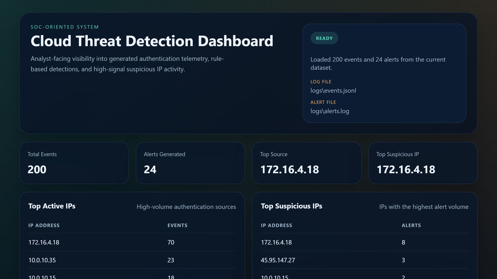
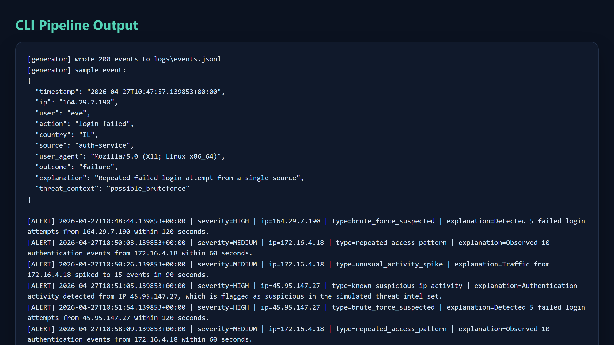
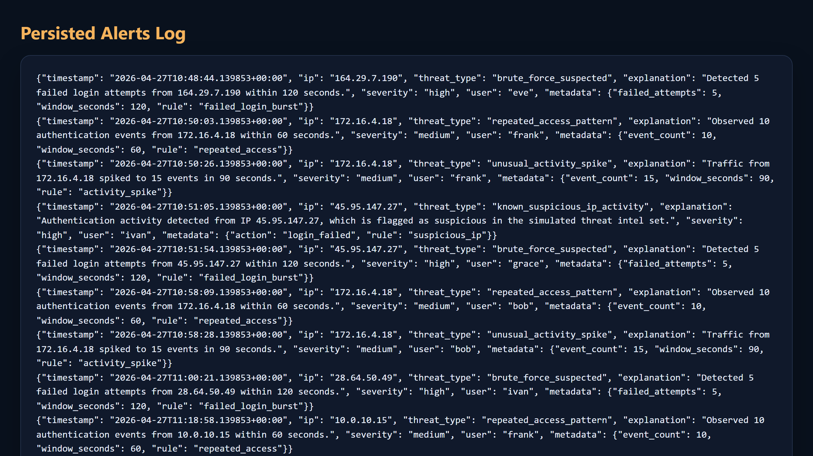

# Cloud Threat Detection Pipeline (SOC-Oriented System)

[](https://github.com/RamBeer6/soc-cloud-threat-detection-pipeline/actions/workflows/ci.yml)

A production-style Python project that simulates a real Security Operations Center (SOC) detection pipeline. The system generates structured authentication logs, analyzes them with rule-based detection logic, emits alerts, and prints an operational dashboard summary.

This repository is designed for a GitHub portfolio targeting cybersecurity, DevSecOps, detection engineering, and SOC analyst roles.

## Why This Project Matters

Modern SOC teams depend on telemetry pipelines that can transform noisy authentication events into actionable findings. This project demonstrates the practical building blocks behind that workflow:

- realistic log generation instead of toy input
- detection rules for brute-force behavior, suspicious IP activity, repeated access patterns, and short-window spikes
- alerting that preserves analyst context
- Dockerized execution for portable local testing
- code structure that is easy to extend with new detections

## What the System Does

The pipeline performs four core functions:

1. Generates authentication-style events in JSONL format.
2. Processes the event stream through modular detection rules.
3. Emits alerts to both the console and `logs/alerts.log`.
4. Produces a CLI dashboard with event and alert statistics.

## Key Skills Demonstrated

- SOC-minded detection engineering
- Python automation for security workflows
- structured logging and event normalization
- rule-based threat analysis with configurable thresholds
- alert forwarding and lightweight security integrations
- Docker packaging and local developer ergonomics
- automated testing for pipeline reliability

## Threat Scenarios Covered

- brute-force login attempts from a single IP
- repeated access bursts from the same source
- unusual short-window activity spikes
- traffic from simulated threat-intelligence IPs
- malformed input handling in the analysis layer

## Architecture Overview

```text
+-------------------+       +-------------------+       +-------------------+
|   Log Generator   | ----> |   Log Analyzer    | ----> |   Alert Manager   |
| JSONL auth events |       | Rule-based engine |       | Console + file    |
+-------------------+       +-------------------+       +-------------------+
                                      |
                                      v
                            +-------------------+
                            |  CLI Dashboard    |
                            | SOC-style summary |
                            +-------------------+
```

## Detection Logic

The analyzer is intentionally structured around discrete rules so future detections can be added without rewriting the full pipeline.

Current detections:

- `brute_force_suspected`
  Triggers when failed logins from the same IP exceed the configured threshold within a short time window.
- `repeated_access_pattern`
  Triggers when the same IP generates a high number of authentication events inside a short interval.
- `unusual_activity_spike`
  Triggers when activity volume from a single IP spikes sharply inside a rolling window.
- `known_suspicious_ip_activity`
  Triggers when an event originates from an IP in the simulated threat-intelligence list.

Default thresholds:

- Failed logins: `5` in `120` seconds
- Repeated access: `10` events in `60` seconds
- Activity spike: `15` events in `90` seconds

## Project Structure

```text
Cloud Threat Detection Pipeline (SOC Project)/
|-- docker/
|   |-- Dockerfile
|   `-- docker-compose.yml
|-- logs/
|   |-- alerts.log
|   `-- events.jsonl
|-- src/
|   |-- alerts.py
|   |-- analyzer.py
|   |-- detector_rules.py
|   |-- log_generator.py
|   |-- main.py
|   `-- web_dashboard.py
|-- static/
|   `-- dashboard.css
|-- templates/
|   `-- dashboard.html
|-- README.md
`-- requirements.txt
```

## Example Log Event

```json
{
  "timestamp": "2026-04-16T11:41:15.792790+00:00",
  "ip": "45.95.147.27",
  "user": "ivan",
  "action": "login_failed",
  "country": "CN",
  "source": "auth-service",
  "user_agent": "Mozilla/5.0 (X11; Linux x86_64)",
  "outcome": "failure",
  "explanation": "Authentication attempt from an IP marked as suspicious",
  "threat_context": "known_bad_ip"
}
```

## Example Alert

```json
{
  "timestamp": "2026-04-16T11:42:04.792790+00:00",
  "ip": "45.95.147.27",
  "threat_type": "brute_force_suspected",
  "explanation": "Detected 5 failed login attempts from 45.95.147.27 within 120 seconds.",
  "severity": "high",
  "user": "grace",
  "metadata": {
    "failed_attempts": 5,
    "window_seconds": 120,
    "rule": "failed_login_burst"
  }
}
```

## Example Dashboard Output

```text
SOC PIPELINE DASHBOARD
======================
Total events processed : 200
Alerts generated      : 24

Top active IPs:
  - 172.16.4.18: 70 events
  - 10.0.10.35: 23 events

Top suspicious IPs:
  - 172.16.4.18: 8 alerts
  - 45.95.147.27: 3 alerts

Alert types:
  - brute_force_suspected: 8
  - repeated_access_pattern: 6
  - unusual_activity_spike: 6
  - known_suspicious_ip_activity: 4
```

## Screenshots

### Web Dashboard


### CLI Output


### Alerts Log


## How to Run Locally

### 1. Generate sample logs only

```bash
python src/main.py generate --count 200 --output logs/events.jsonl --seed 42
```

### 2. Analyze existing logs only

```bash
python src/main.py analyze --input logs/events.jsonl --alerts-output logs/alerts.log
```

### 3. Run the full pipeline

```bash
python src/main.py run --count 200 --output logs/events.jsonl --alerts-output logs/alerts.log --seed 42
```

### 4. Run individual modules directly

```bash
python src/log_generator.py --count 200 --output logs/events.jsonl --seed 42
python src/analyzer.py --input logs/events.jsonl --alerts-output logs/alerts.log
```

## Docker Setup

Build and run the full pipeline:

```bash
docker compose -f docker/docker-compose.yml up --build
```

The container writes generated events and alerts into the local `logs/` directory through a mounted volume.

## Web Dashboard

Launch the Flask dashboard against the current log set:

```bash
python src/main.py dashboard --input logs/events.jsonl --alerts-output logs/alerts.log
```

Then open:

```text
http://127.0.0.1:5000
```

The dashboard shows:

- total processed events
- total alerts generated
- top active IPs
- top suspicious IPs
- alert-type breakdown
- recent persisted alerts

## Alert Forwarding

The pipeline can optionally forward alerts to a webhook endpoint as JSON. This is useful for simulating integrations with:

- Slack incoming webhooks
- custom SOAR handlers
- incident routing services
- internal security automation endpoints

Run with a webhook explicitly:

```bash
python src/main.py run --webhook-url https://example.com/security-alerts
```

Or define it with an environment variable:

```bash
export SOC_ALERT_WEBHOOK_URL=https://example.com/security-alerts
python src/main.py analyze
```

An example environment file is included in `/.env.example`.

## Testing

Run the automated test suite:

```bash
python -m unittest discover -s tests -v
```

The tests validate:

- log generation and required event fields
- end-to-end detection of all core alert types
- alert log persistence in valid JSON format
- input validation for malformed events
- webhook delivery behavior
- dashboard rendering

## Developer Shortcuts

If you use `make`, the project includes common targets:

```bash
make install
make test
make run
make dashboard
```

## GitHub Presentation Checklist

Before publishing, the repo is already structured to support a strong showcase:

- professional README with architecture and execution guidance
- Dockerized runnable demo
- automated tests
- optional webhook integration
- CLI and web dashboard views
- clean repository hygiene with `.gitignore`

For ready-to-paste GitHub repository metadata, see [docs/github-launch-kit.md](docs/github-launch-kit.md).

## Supporting Docs

- [Detection Rules Reference](docs/detection-rules.md)
- [Sample Incident Report](docs/sample-incident-report.md)

## Linux-Friendly Run Script

For a quick full demo run on Linux or macOS:

```bash
chmod +x run_pipeline.sh
./run_pipeline.sh
```

## Technologies Used

- Python 3.12
- JSONL structured logging
- Rule-based detection engineering
- Docker and Docker Compose
- Linux-compatible command flow

## License

This project is released under the MIT License. See `LICENSE`.

## Why It Works Well for a Security Portfolio

This project showcases skills that map directly to security engineering and SOC work:

- threat detection mindset
- Python automation for security workflows
- log parsing and event enrichment
- alert design and operational output
- modular architecture suitable for future SIEM or cloud integrations

## Future Enhancements

Possible next upgrades for a more advanced version:

- ingest logs from Kafka, syslog, or CloudWatch
- export alerts to Slack, email, or a ticketing system
- store telemetry in PostgreSQL or Elasticsearch
- enrich suspicious IPs with external threat intelligence feeds
